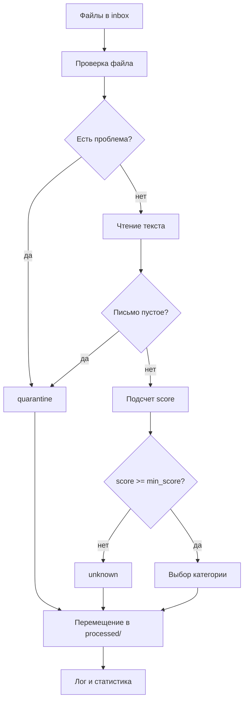

# Automated Corporate Mail Processor

Система автоматизированной обработки корпоративной почты для IT-поддержки.

Проект читает письма из папки `inbox`, классифицирует их по смысловым
категориям, раскладывает по папкам результата и формирует основу для отчета по
обработке обращений.

## Задача

IT-поддержка ежедневно получает много писем. При ручной сортировке важные сообщения могут теряться среди
обычных запросов.

Цель проекта: автоматизировать первичную сортировку писем, чтобы:

- быстрее находить критические инциденты;
- отделять спам и подозрительные письма;
- раскладывать обращения по понятным рабочим категориям;
- сохранять письма, которые не удалось уверенно классифицировать, для ручной
  проверки;
- получать статистику по обработанным письмам.

## Как работает решение

Классификация основана на наборе правил из файла `categories.json`.
Основная логика обработки находится в `src/processor.py`: этот модуль
готовит папки результата, читает входящие файлы, вызывает классификатор,
перемещает письма, обновляет статистику и пишет лог.

Для каждой категории заданы:

- `strong_keywords` - сильные признаки категории, дают больший вес;
- `keywords` - обычные признаки категории;
- `priority` - приоритет категории при равном количестве совпадений;
- `folder` - папка, в которую должно попасть письмо.

Алгоритм:

1. Текст письма приводится к нижнему регистру.
2. Буква `ё` заменяется на `е`, чтобы не терять совпадения.
3. Для каждой категории считается score:
   - сильное ключевое слово добавляет `2` балла;
   - обычное ключевое слово добавляет `1` балл.
4. Выбирается категория с максимальным score.
5. Если score меньше `min_score`, письмо попадает в категорию
   `unknown`.
6. Если несколько категорий набрали одинаковый score, выбирается категория с
   более высоким `priority`.



## Категории

Категории выбраны так, чтобы отражать реальные типы писем, которые получает
IT-поддержка:

| Категория | Назначение |
|---|---|
| `01_spam_phishing` | спам, фишинг, подозрительные ссылки и запросы паролей |
| `02_critical_incidents` | критические инциденты, массовые сбои, недоступность сервисов |
| `03_access_requests` | доступы, учетные записи, права пользователей |
| `04_hardware_requests` | проблемы с оборудованием и заявки на ремонт |
| `05_software_support` | проблемы с пользовательским ПО |
| `06_finance_documents` | счета, договоры, акты и документы на оплату |
| `07_hr_admin` | HR- и административные запросы |
| `08_external_clients` | обращения от внешних клиентов и партнеров |
| `09_monitoring_notifications` | автоматические уведомления мониторинга |
| `11_info_news` | информационные письма, дайджесты, созвоны |
| `10_unknown_unclassified` | письма, которые не удалось уверенно классифицировать |

Отдельно в конфигурации предусмотрены quarantine-категории для проблемных
случаев:

| Категория | Назначение |
|---|---|
| `90_quarantine_empty` | пустые письма без содержимого |
| `91_quarantine_unsupported` | файлы неподдерживаемого формата, например не `.txt` |
| `92_quarantine_corrupted` | повреждённые файлы или файлы, при обработке которых возникла неизвестная ошибка |
| `93_quarantine_decode_error` | текстовые файлы, которые не удалось прочитать в UTF-8 |

## Структура проекта

```text
.
├── inbox/                  # входящие письма для обработки
├── processed/              # результат обработки: письма по категориям, статистика и отчеты
├── logs/                   # логи обработки
├── src/                    # исходный код приложения
│   ├── classifier.py       # логика классификации писем
│   ├── mail.py             # модель письма
│   ├── processor.py        # чтение, обработка, перемещение, логи и статистика
│   ├── visualization.py    # построение графика и HTML-отчета
│   └── main.py             # точка входа приложения
├── tests/                  # тесты проекта
│   ├── test_classifier.py  # тесты классификатора
│   ├── test_mail.py        # тесты класса mail
│   ├── test_main.py        # тесты main
│   └── test_processor.py   # тесты чтения и обработки файлов
├── categories.json         # правила классификации и настройки категорий
├── run.sh                  # bash-скрипт запуска
├── requirements.txt        # зависимости проекта
├── .gitignore              # исключения для Git
├── CONTRIBUTING.md         # правила командной работы с Git
└── README.md               # описание проекта
```

## Запуск

### 1. Подготовить окружение

Для запуска нужен Python 3.10+.

```bash
python --version
```

Установить внешние зависимости:

```bash
pip install -r requirements.txt
```

### 2. Запустить приложение

```bash
python src/main.py
```

После запуска письма из `inbox` должны быть обработаны и разложены по папкам в
`processed`.

### 3. Запуск через bash-скрипт

Если используется bash-скрипт запуска:

```bash
chmod +x run.sh
./run.sh
```

## Тесты

Запуск тестов:

```bash
python -m pytest
```

В проекте реализованы тесты:

- чтение письма из файла;
- классификацию по ключевым словам;
- попадание неизвестных писем в `unknown`;
- обработку пустых файлов;
- обработку неподдерживаемых или поврежденных форматов.

## Пример результата

После обработки в `processed` ожидается структура вида:

```text
processed/
├── 01_spam_phishing/
├── 02_critical_incidents/
├── 03_access_requests/
├── 04_hardware_requests/
├── 05_software_support/
├── 06_finance_documents/
├── 07_hr_admin/
├── 08_external_clients/
├── 09_monitoring_notifications/
├── 10_unknown_unclassified/
├── 11_info_news/
├── 90_quarantine_empty/
├── 91_quarantine_unsupported/
├── 92_quarantine_corrupted/
├── 93_quarantine_decode_error/
├── statistics.txt
├── statistics.png
└── report.html
```
С перемещёнными письмами из `inbox` в соответствующие папки.

В логах и статистике фиксируется, сколько писем попало в каждую категорию и
какие файлы были обработаны.

Дополнительно после обработки формируются файлы:

- `processed/statistics.txt` - текстовая статистика по категориям;
- `processed/statistics.png` - график количества писем по категориям;
- `processed/report.html` - HTML-отчет с общей статистикой, top-категориями и графиком.

## Как расширять классификацию

Чтобы добавить новую категорию или улучшить существующую:

1. Открыть `categories.json`.
2. Добавить новую запись в `categories` или изменить существующую.
3. Указать `id`, `title`, `folder`, `priority`, `description`.
4. Заполнить `strong_keywords` и `keywords`.
5. Запустить тесты.
6. Проверить результат на письмах из `inbox`.

Изменение категорий не требует переписывать код классификатора: правила вынесены
в отдельный JSON-конфиг.

## Ограничения

Текущая классификация основана на ключевых словах. Это делает решение
понятным и простым, но допускает ситуации:

- возможны ложные срабатывания при совпадении отдельных слов;
- сложные письма с несколькими темами могут быть отнесены только к одной
  категории.

## Командная работа

Правила работы с ветками, коммитами и Pull Request описаны в
`CONTRIBUTING.md`.
