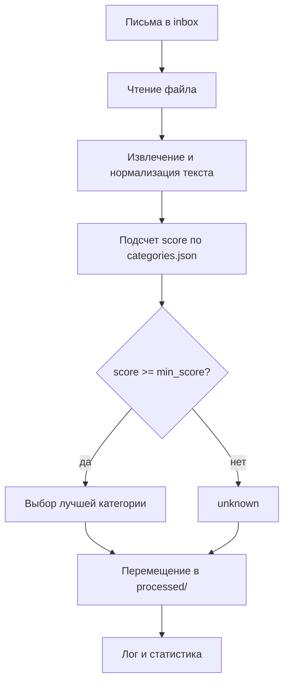

# Automated Corporate Mail Processor

Система автоматизированной обработки корпоративной почты для IT-поддержки.

Проект читает письма из папки `inbox`, классифицирует их по смысловым
категориям, раскладывает по папкам результата и формирует основу для отчета по
обработке обращений.

## Задача

IT-поддержка ежедневно получает много писем: критические инциденты, запросы
доступов, обращения по оборудованию, финансовые документы, автоматические
уведомления и спам. При ручной сортировке важные сообщения могут теряться среди
обычных запросов.

Цель проекта — автоматизировать первичную сортировку писем, чтобы:

- быстрее находить критические инциденты;
- отделять спам и подозрительные письма;
- раскладывать обращения по понятным рабочим категориям;
- сохранять письма, которые не удалось уверенно классифицировать, для ручной
  проверки;
- получать статистику по обработанным письмам.

## Как работает решение

Классификация основана на наборе правил из файла `categories.json`.

Для каждой категории заданы:

- `strong_keywords` — сильные признаки категории, дают больший вес;
- `keywords` — обычные признаки категории;
- `priority` — приоритет категории при равном количестве совпадений;
- `folder` — папка, в которую должно попасть письмо.

Алгоритм:

1. Текст письма приводится к нижнему регистру.
2. Буква `ё` заменяется на `е`, чтобы не терять совпадения.
3. Для каждой категории считается score:
   - сильное ключевое слово добавляет `2` балла;
   - обычное ключевое слово добавляет `1` балл.
4. Выбирается категория с максимальным score.
5. Если score меньше `min_score`, письмо попадает в категорию
   `unknown`.
6. Если несколько категорий набрали одинаковый score, выбирается категория с
   более высоким `priority`.



## Категории

Категории выбраны так, чтобы отражать реальные типы писем, которые получает
IT-поддержка:

| Категория | Назначение |
|---|---|
| `01_spam_phishing` | спам, фишинг, подозрительные ссылки и запросы паролей |
| `02_critical_incidents` | критические инциденты, массовые сбои, недоступность сервисов |
| `03_access_requests` | доступы, учетные записи, права пользователей |
| `04_hardware_requests` | проблемы с оборудованием и заявки на ремонт |
| `05_software_support` | проблемы с пользовательским ПО |
| `06_finance_documents` | счета, договоры, акты и документы на оплату |
| `07_hr_admin` | HR- и административные запросы |
| `08_external_clients` | обращения от внешних клиентов и партнеров |
| `09_monitoring_notifications` | автоматические уведомления мониторинга |
| `11_info_news` | информационные письма, дайджесты, созвоны |
| `10_unknown_unclassified` | письма, которые не удалось уверенно классифицировать |

Отдельно в конфигурации предусмотрены quarantine-категории для проблемных
случаев:

- пустые письма;
- неподдерживаемые форматы;
- поврежденные файлы;
- ошибки чтения текста.

Такой подход позволяет не терять нестандартные входные данные: даже если письмо
не подходит ни под одну категорию или файл невозможно корректно прочитать, оно
должно попадать в отдельную папку для ручного анализа.

## Структура проекта

```text
.
├── inbox/              # входящие письма
├── processed/          # результат обработки
├── logs/               # логи обработки
├── src/                # исходный код приложения
│   ├── classifier.py   # логика классификации писем
│   ├── mail.py         # модель письма
│   └── main.py         # точка входа приложения
├── tests/              # тесты
├── categories.json     # правила классификации и настройки категорий
├── CONTRIBUTING.md     # правила командной работы с Git
├── requirements.txt    # зависимости проекта
└── README.md           # описание проекта
```

## Запуск

### 1. Подготовить окружение

Для запуска нужен Python 3.10+.

```bash
python --version
```

Установить внешние зависимости:

```bash
pip install -r requirements.txt
```

### 2. Запустить приложение

```bash
python src/main.py
```

После запуска письма из `inbox` должны быть обработаны и разложены по папкам в
`processed`.

### 3. Запуск через bash-скрипт

Если используется bash-скрипт запуска:

```bash
chmod +x run.sh
./run.sh
```

На Windows скрипт удобнее запускать через Git Bash, WSL или другую bash-среду.

## Тесты

Запуск тестов:

```bash
python -m pytest
```

Тесты должны проверять:

- чтение письма из файла;
- классификацию по ключевым словам;
- попадание неизвестных писем в `unknown`;
- обработку пустых файлов;
- обработку неподдерживаемых или поврежденных форматов.

## Пример результата

После обработки в `processed` ожидается структура вида:

```text
processed/
├── 01_spam_phishing/
├── 02_critical_incidents/
├── 03_access_requests/
├── 04_hardware_requests/
├── 05_software_support/
├── 06_finance_documents/
├── 07_hr_admin/
├── 08_external_clients/
├── 09_monitoring_notifications/
├── 10_unknown_unclassified/
└── 11_info_news/
```

В логах и статистике фиксируется, сколько писем попало в каждую категорию и
какие файлы были обработаны.

## Обработка нестандартных ситуаций

Проект рассчитан на то, что входные данные могут быть неоднородными:

- письмо может быть пустым;
- файл может иметь неизвестное расширение;
- содержимое может быть повреждено;
- письмо может не совпадать ни с одной категорией;
- новый тип обращения может появиться уже после настройки правил.

Для таких случаев используется категория `unknown` и quarantine-группы из
`categories.json`. Это делает поведение системы предсказуемым: файл не теряется,
а попадает в отдельную папку для дальнейшего анализа.

## Как расширять классификацию

Чтобы добавить новую категорию или улучшить существующую:

1. Открыть `categories.json`.
2. Добавить новую запись в `categories` или изменить существующую.
3. Указать `id`, `title`, `folder`, `priority`, `description`.
4. Заполнить `strong_keywords` и `keywords`.
5. Запустить тесты.
6. Проверить результат на письмах из `inbox`.

Изменение категорий не требует переписывать код классификатора: правила вынесены
в отдельный JSON-конфиг.

## Ограничения

Текущая классификация основана на правилах и ключевых словах. Это делает решение
понятным и объяснимым, но у подхода есть ограничения:

- возможны ложные срабатывания при совпадении отдельных слов;
- сложные письма с несколькими темами могут быть отнесены только к одной
  категории;
- качество классификации зависит от полноты `categories.json`.

Дальнейшее развитие проекта может включать визуальный отчет, preview-режим перед
перемещением файлов, более гибкий анализ текста или ML-классификатор поверх
базовых правил.

## Командная работа

Правила работы с ветками, коммитами и Pull Request описаны в
`CONTRIBUTING.md`.
